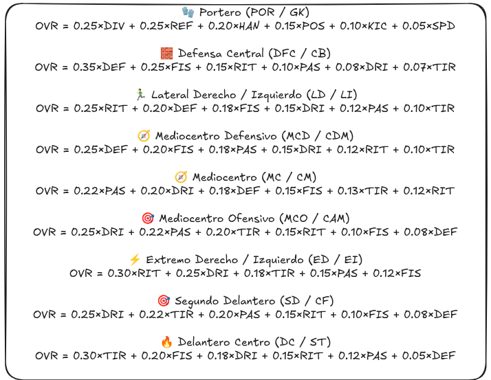

# 🏟 Proyecto: FIFA FC

Este proyecto implementa un API REST con Django REST Framework para gestionar **usuarios**, **cartas de jugadores** y **equipos de cartas**. Permite crear usuarios, crear y asignar equipos a usuarios, limitar cartas por posición, y validar reglas de negocio como duplicados y número máximo/mínimo de cartas por equipo.


## Guia de instalación y uso

### 📂 Diagrama de ficheros y descripción

```
DESAFIO-PAUF/
│
├─ api/                     # Aplicación principal de Django
│  ├─ data/                 # Datos iniciales
│  │   └─ cards.json        # Cartas iniciales
│  ├─ management/commands/  # Comandos custom de Django
│  │   ├─ load_cards.py     # Comando para cargar cartas desde JSON
│  │   └─ load_users.py     # Comando para cargar usuarios de prueba
│  ├─ migrations/           # Migraciones de la base de datos
│  ├─ tests/                # Tests unitarios y de endpoints
│  │   ├─ test_basics.py
│  │   ├─ test_commands.py
│  │   ├─ test_endpoints.py
│  │   └─ test_methods.py
│  ├─ admin.py              # Configuración admin Django
│  ├─ apps.py               # Configuración de la app
│  ├─ models.py             # Modelos (User, Card, Team)
│  ├─ serializers.py        # Serializers de DRF
│  ├─ urls.py               # URLs de la app
│  └─ views.py              # Vistas (endpoints REST)
│
├─ fifaproject/             # Proyecto Django
│  ├─ asgi.py
│  ├─ settings.py
│  ├─ urls.py
│  └─ wsgi.py
│
├─ resources/
│  └─ image.png             # Imagen de recursos
│
├─ utils/                   # Scripts auxiliares
│  ├─ extract_cards_from_csv.py  # Extrae cartas de CSV a JSON
│  └─ sofifa_players.csv        # CSV con datos de jugadores
│
├─ venv/                    # Entorno virtual
├─ manage.py                # Script principal Django
├─ README.md                # Documentación
└─ requirements.txt         # Dependencias Python
```

---

### ⚡ Pasos para usar el proyecto

#### 1️⃣ Clonar el repositorio

```bash
git clone https://github.com/GsuDev/Desafio-PAUF
cd DESAFIO-PAUF
```

#### 2️⃣ Crear el entorno virtual

**Windows**

```bash
python -m venv venv
```

**Linux / macOS**

```bash
python3 -m venv venv
```

#### 3️⃣ Activar el entorno virtual

**Windows**

```bash
venv\Scripts\activate
```

**Linux / macOS**

```bash
source venv/bin/activate
```

#### 4️⃣ Instalar dependencias

```bash
pip install -r requirements.txt
```

#### 5️⃣ Instalar extensión REST CLIENT

* Instalar la extensión **REST Client** en VS Code: `humao.rest-client`
* Abrir `client.http` para probar los endpoints desde VS Code.

#### 6️⃣ Migraciones de base de datos

```bash
python manage.py makemigrations
python manage.py migrate
```

#### 7️⃣ Cargar datos iniciales

```bash
python manage.py load_cards --limit <numero de cartas>
python manage.py load_users
```

#### 8️⃣ Arrancar el servidor

```bash
python manage.py runserver
```

* Por defecto, se levanta en `http://127.0.0.1:8000/`

#### 9️⃣ Ejecutar tests

```bash
python manage.py test
```


## 📦 Modelos

### User

| Campo        | Tipo                | Descripción                                          |
| ------------ | ------------------- | ---------------------------------------------------- |
| `id`         | Integer (AutoField) | Identificador único                                  |
| `name`       | CharField           | Nombre del usuario                                   |
| `email`      | EmailField          | Email único del usuario                              |
| `password`   | CharField           | Contraseña (guardada en texto plano en este ejemplo) |
| `team`       | OneToOneField(Team) | Equipo asignado al usuario                           |
| `created_at` | DateTimeField       | Fecha de creación                                    |

### Card

| Campo              | Tipo          | Descripción                                    |
| ------------------ | ------------- | ---------------------------------------------- |
| `id`               | Integer       | Identificador único                            |
| `name`             | CharField     | Nombre del jugador                             |
| `country`          | CharField     | País del jugador                               |
| `club`             | CharField     | Club del jugador                               |
| `league`           | CharField     | Liga en la que juega                           |
| `position`         | CharField     | Posición del jugador (POR, LD, DFC, etc.)      |
| `pace` ... `speed` | Integer       | Estadísticas del jugador (0–99)                |
| `active`           | Boolean       | Si la carta está activa o eliminada            |
| `overall_rating`   | Integer       | Valor calculado automáticamente según posición |
| `created_at`       | DateTimeField | Fecha de creación                              |

### Team

| Campo        | Tipo                  | Descripción                |
| ------------ | --------------------- | -------------------------- |
| `id`         | Integer               | Identificador único        |
| `name`       | CharField             | Nombre del equipo          |
| `cards`      | ManyToManyField(Card) | Cartas asociadas al equipo |
| `created_at` | DateTimeField         | Fecha de creación          |

---

## 🔗 Endpoints

### Usuarios

| Endpoint       | Método    | Descripción               | Body / Query                                                 | Respuesta                                                                              | Errores                                      |
| -------------- | --------- | ------------------------- | ------------------------------------------------------------ | -------------------------------------------------------------------------------------- | -------------------------------------------- |
| `/users/`      | GET       | Lista todos los usuarios  | —                                                            | `[{"id":1,"name":"Juan","email":"juancastillo@example.com","team":null,"created_at":"..."}]` | —                                            |
| `/users/`      | POST      | Crea un nuevo usuario     | `{ "name": "Test User", "email": "...", "password": "..." }` | `201 Created` con usuario                                                              | `400` si email duplicado o falta algún campo |
| `/users/<pk>/` | GET       | Obtiene un usuario por ID | —                                                            | `200 OK` con datos del usuario                                                         | `404` si no existe                           |
| `/users/<pk>/` | PUT/PATCH | Actualiza usuario         | `{ "name": "...", "email": "..." }`                          | `200 OK` con usuario actualizado                                                       | `404` si no existe                           |
| `/users/<pk>/` | DELETE    | Elimina usuario           | —                                                            | `204 No Content`                                                                       | `404` si no existe                           |

---

### Cartas (Cards)

| Endpoint       | Método    | Descripción            | Body / Query                                        | Respuesta                        | Errores                                   |
| -------------- | --------- | ---------------------- | --------------------------------------------------- | -------------------------------- | ----------------------------------------- |
| `/cards/`      | GET       | Lista todas las cartas | —                                                   | `[{"id":1,"name":"Messi", ...}]` | —                                         |
| `/cards/`      | POST      | Crea una carta nueva   | `{ "name":"...", "position":"DC", "pace":90, ... }` | `201 Created` con carta          | `400` si stats fuera de rango (0-99)      |
| `/cards/<pk>/` | GET       | Obtiene carta por ID   | —                                                   | `200 OK`                         | `404` si no existe                        |
| `/cards/<pk>/` | PUT/PATCH | Actualiza carta        | `{ ... }`                                           | `200 OK`                         | `404` si no existe, `400` stats inválidos |
| `/cards/<pk>/` | DELETE    | Desactiva carta        | —                                                   | `204 No Content`                 | `400` si la carta está en algún equipo    |


### Equipo de usuario (`UserTeamView`)

| Método                     | Descripción                          | Body                                  | Respuesta                            | Errores                                                                                               |
| -------------------------- | ------------------------------------ | ------------------------------------- | ------------------------------------ | ----------------------------------------------------------------------------------------------------- |
| GET `/users/<pk>/team/`    | Obtiene el equipo del usuario        | —                                     | `200 OK` con equipo y cartas activas | `404` si usuario o equipo no existe                                                                   |
| POST `/users/<pk>/team/`   | Crea un equipo si no tiene (permite crearlo vacío)           | `{ "name": "...", "card_ids":[...] }` | `201 Created` y usuario con su nuevo equipo                        | `404` usuario no existe, `400` y mensaje personalizado  si ya tiene equipo, si >25 cartas o duplicadas, si límites de posición |
| PATCH `/users/<pk>/team/`  | Actualiza nombre o cartas del equipo | `{ "name": "...", "card_ids":[...] }` | `200 OK` y usuario con el equipo actualizado                             | `404` usuario/equipo no existe, `400` reglas violadas                                                 |
| DELETE `/users/<pk>/team/` | Elimina equipo del usuario           | —                                     | `204 No Content`                     | `404` usuario/equipo no existe                                                                        |

---

### ⚠️ Validaciones importantes

* Los equipos deben tener **entre 23 y 25 cartas**.

* No se permiten cartas duplicadas.

* Límites por posición:

  * Porteros: 2–3
  * Defensas: 8–10
  * Centrocampistas: 6–9
  * Delanteros: 5–6

* Cartas desactivadas (`active=False`) no se muestran en la respuesta de las rutas de UserTeam pero si en las de Cards.

---

### Ejemplo de POST para crear equipo de usuario

```json
POST /users/1/team/
{
  "name": "Dream Team",
  "card_ids": [1,2,3,4,5,6,7,8,9,10,11,12,13,14,15,16,17,18,19,20,21,22,23]
}
```

Respuesta:

```json
{
  "id": 1,
  "name": "User1",
  "email": "user1@example.com",
  "created_at": "2025-11-09T19:00:00Z",
  "team": {
    "id": 1,
    "name": "Dream Team",
    "created_at": "2025-11-09T19:10:00Z",
    "cards": [
      {"id":1,"name":"Messi", ... },
      {"id":2,"name":"Cristiano", ... }
    ]
  }
}
```

### Ejemplo de PATCH para añadir cartas al equipo de un usuario

```json
POST /users/1/team/
{
  "card_ids": [1,2,3,4,5,6,7,8,9,10,11,12,13,14,15,16,17,18,19,20,21,22,23]
}
```

Respuesta:

```json
{
  "id": 1,
  "name": "User1",
  "email": "user1@example.com",
  "created_at": "2025-11-09T19:00:00Z",
  "team": {
    "id": 1,
    "name": "Dream Team",
    "created_at": "2025-11-09T19:10:00Z",
    "cards": [
      {"id":1,"name":"Messi", ... },
      {"id":2,"name":"Cristiano", ... }
    ]
  }
}
```
## Comandos del proyecto

### 1️⃣ Comando: Cargar cartas desde un JSON

**Archivo:** `api/management/commands/load_cards.py`
**Modelo afectado:** `Card`
**Propósito:** Cargar cartas de fútbol desde un archivo JSON a la base de datos.

#### Descripción

Este comando lee un archivo JSON (`api/data/cards.json`) y crea instancias del modelo `Card` en la base de datos. Permite opcionalmente limitar el número de cartas a cargar con un argumento `--limit`.

#### Uso

```bash
python manage.py load_cards
```

Con límite:

```bash
python manage.py load_cards --limit 50
```

#### Argumentos

| Argumento | Tipo | Descripción                                                                         |
| --------- | ---- | ----------------------------------------------------------------------------------- |
| `--limit` | int  | Número máximo de cartas a cargar (entre 0 y 600). Si no se indica, se cargan todas. |

#### Flujo de ejecución

1. Abre el archivo JSON `api/data/cards.json`.
2. Si se especifica `--limit`, recorta la lista de cartas.
3. Por cada carta en el JSON:

   * Crea un objeto `Card` con los campos del JSON (nombre, país, club, liga, posición, estadísticas…).
   * Guarda la carta en la base de datos.
4. Muestra un mensaje de éxito con el número de cartas cargadas.

#### Posibles errores

* Archivo no encontrado: `api/data/cards.json`.
* Formato JSON inválido.
* Faltan campos necesarios en el JSON.

**Ejemplo de mensaje de éxito:**

```
✅ 100 cartas cargadas satisfactoriamente!
```

---

### 2️⃣ Comando: Crear usuarios de ejemplo

**Archivo:** `api/management/commands/load_users.py`
**Modelo afectado:** `User`
**Propósito:** Crear 30 usuarios de ejemplo en la base de datos sin asignarles equipo.

#### Descripción

Este comando usa la librería `Faker` para generar 30 usuarios ficticios con nombre, email y contraseña aleatoria, y los inserta en la base de datos de golpe usando `bulk_create`.

#### Uso

```bash
python manage.py load_users
```

#### Flujo de ejecución

1. Se inicializa un objeto `Faker()`.
2. Se genera un listado de 30 usuarios con datos aleatorios.
3. Se insertan todos los usuarios en la base de datos usando `bulk_create`.
4. Muestra un mensaje de éxito al terminar.

**Ejemplo de mensaje de éxito:**

```
✅ 30 users successfully created!
```

#### Notas

* No se asigna equipo ni otros datos adicionales.

## Calculo de OVR por posicion


